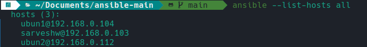
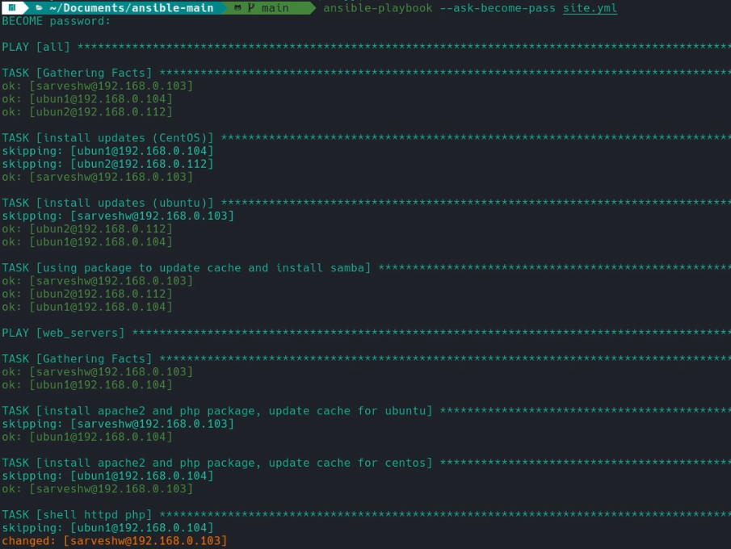
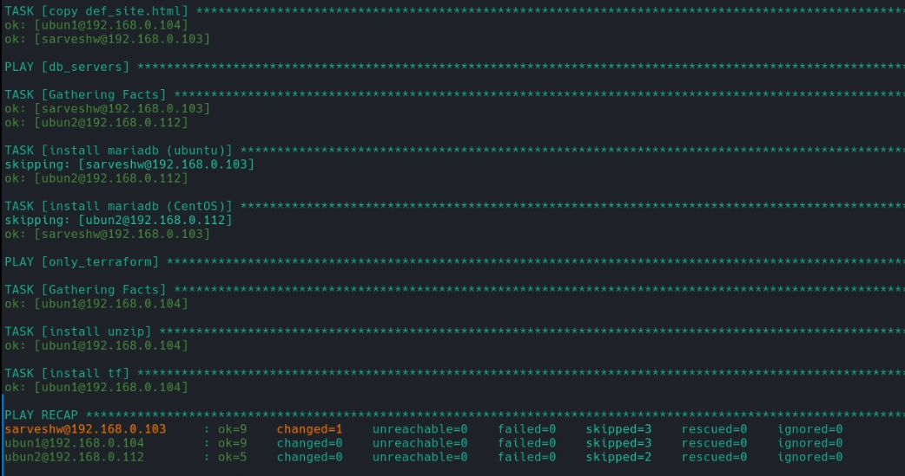
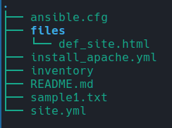
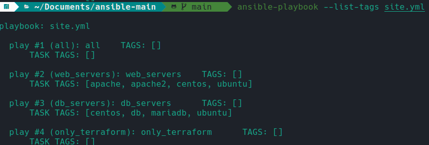

# Automated Server Management with Ansible

The "Automated Server Management with Ansible" project is a powerful configuration management solution that enables the automation of multiple servers using Ansible. With this project, you can streamline and automate server builds, updates, module installations, file and user management, service management, and more across multiple servers simultaneously. By leveraging the capabilities of Ansible, this solution simplifies the management and maintenance of server infrastructure, saving time and ensuring consistency across the entire server fleet. Whether you are managing a small-scale environment or a large-scale infrastructure, this project provides an efficient and scalable approach to automate server management tasks with ease.

## Installation Process:

To run this project, you will need to ensure that SSH and Ansible are properly installed and configured. Here are the high-level steps:

#### 1. SSH Installation:

Follow the instructions in the [SSH Installation Guide](https://github.com/Saru2003/Automated-Server-Management-with-Ansible/blob/main/ssh%20installation%20and%20setup.md) for detailed instructions on installing and setting up SSH.

#### 2. Ansible Installation:

Proceed with the installation of Ansible by following the steps outlined in the [Ansible Installation Guide](https://github.com/Saru2003/Automated-Server-Management-with-Ansible/blob/main/ansible%20installation%20guide.md).

#### 3. Virtual Servers Setup:

For this project, I have utilized three virtual machines running on VirtualBox: two Ubuntu servers and one CentOS server. Using virtual machines provides a flexible and isolated environment for testing and development purposes, allowing you to simulate real-world server setups without the need for separate physical hardware.

Here's how to set up the virtual servers:

- Create Virtual Machines:

    - Set up three virtual machines using VirtualBox, assigning them appropriate resources (CPU, memory, storage, etc.).
    - Install the respective operating systems on each virtual machine: two Ubuntu servers and one CentOS server.
    - You can follow the steps outlined in this [video tutorial](https://www.youtube.com/watch?v=hYaCCpvjsEY) for setting up virtual machines.
- SSH Connectivity Check:

    - After setting up the virtual machines, it is important to verify SSH connectivity from your local machine to the virtual servers.
    - You can follow the steps outlined in this [video tutorial](https://www.youtube.com/watch?v=rhFLfwZzlGA) for checking SSH connectivity.

Once both SSH and Ansible are installed and configured, you can proceed with running the project successfully.

Please refer to the respective installation guides linked above for detailed instructions on setting up SSH and Ansible.

## Server Management with Ansible
### Inventory and Connecting to Servers
The inventory file contains the IP addresses of the servers we want to manage. To establish connections and perform tasks on the servers, we use the `ansible` command. For example, the command 
```bash
ansible all --key-file ~/.ssh/ansible -i inventory -m ping
```
 connects to each host in the inventory and pings them. To simplify this process, we can create a default configuration file called `ansible.cfg`. By setting defaults such as the inventory file and private key, we can shorten the command to 
 ```bash
 ansible all -m ping.
 ```

### Ad-hoc Commands
Ansible provides a range of ad-hoc commands for executing tasks on managed servers. Here are some basic commands:

- `ansible all --list-hosts`: Lists all the hosts in the inventory.
- `ansible all -m gather_facts`: Retrieves information about the servers, such as processor and operating system details.
- `ansible all -m gather_facts --limit <ip_address>`: Limits the command to a specific host.

To perform tasks that require elevated privileges, you can use the `--become` option, which tells Ansible to use sudo. For example, 
```bash
ansible all -m apt -a update_cache=true --become --ask-become-pass
```
 updates the package cache on all servers.

To install packages, you can use the apt module. For instance:

```bash
ansible all -m apt -a name=vim-nox --become --ask-become-pass
```
 installs the vim-nox package.

```bash
ansible all -m apt -a "name=snapd state=latest" --become --ask-become-pass
```
 installs the latest version of the snapd package.

 ### Ansible Playbooks for Automation
Ansible Playbooks allow us to define a list of tasks that automatically execute against hosts. Consider the example playbook `ins_apache.yml`, which installs the latest version of Apache and PHP packages and updates the cache. The playbook contains separate tasks for Ubuntu and CentOS distributions to handle the differences in package management.

Under the task "Install Apache2 and PHP package, update cache for Ubuntu," the __apt__ module is used to install the packages and update the cache. For CentOS, the __dnf__ module is used. 

After installing Apache on the servers, it is essential to ensure that the service is running and accessible. While typing the IP address of one of the servers in your local machine's browser should display the Apache page for Ubuntu, the same isn't true for CentOS. In CentOS, although Apache is installed, it needs to be started, and communication on port 80 must be allowed to make it accessible.

To automate this process, the following steps can be included in your Ansible playbook:

- Under the CentOS task in your playbook, use the service module to manage the Apache service:
```bash
- name: Start Apache and allow communication on port 80 (CentOS)
  service:
    name: httpd
    state: started
    enabled: yes
```
By including these steps in your playbook, the Apache service will be started on CentOS, allowing communication on port 80. This ensures that when you type the IP address of a CentOS server in your local machine's browser, you will see the Apache page, indicating a successful setup.

## Site.yml: Customized Server Configuration



In this section, we will explore the `site.yml` playbook and its functionalities. The `site.yml` playbook builds upon the concepts discussed earlier and provides further customization options for server configuration.

### Inventory Groups
In the inventory file, IP addresses can be organized into different groups. In this repository, we have predefined groups such as `only_terraform`, `web_servers`, and `db_servers`. Grouping hosts allows us to perform specific tasks on targeted hosts based on their assigned group(s).

### Pre-Tasks
Under pre-tasks in `site.yml`, we perform actions that should occur before the main tasks. For example, installing updates for Ubuntu and CentOS is placed under pre-tasks to ensure updates are applied before proceeding further. 
Additionally, the installation of Samba is done using the package module, as the `package` name remains the same for both distributions.

### Group-Specific Tasks
Similar to the `ins_apache.yml` playbook, the `site.yml` playbook allows the execution of group-specific tasks. For hosts in the `db_servers` group, we install ___MariaDB___ to set up the necessary database infrastructure.For hosts in the `only_terraform` group, we install and unzip the ***Terraform*** zip file, ensuring appropriate permissions are set. For hosts in the `web_servers` group, shell commands are executed, such as enabling communication via port 80 TCP.

### Copying Files and Setting Permissions
The `site.yml` playbook includes a task named `copy def_site.html` that copies a source file from the files group to the designated destination on the target hosts. 
Additionally, appropriate user permissions are set for the copied file to ensure security and access control.


### Utilizing Tags
One notable addition in the `site.yml` playbook compared to `ins_apache.yml` is the use of `tags`. Tags allow for more granular control and selective execution of tasks.

To list the available tags in a playbook
```bash
ansible-playbook --list-tags site.yml
```

Running a playbook but targeting specific tags
```bash
 ansible-playbook --tags db --ask-become-pass site.yml
 ```

Please refer to the `site.yml` playbook and associated files in this repository for more comprehensive examples and instructions on customizing server configurations using Ansible playbooks.

## License

This project is licensed under the GNU General Public License. See the [LICENSE](https://github.com/Saru2003/Automated-Server-Management-with-Ansible/blob/main/LICENSE) file for details.
