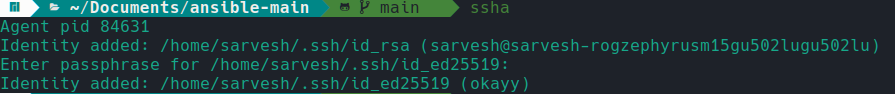

## Generate an ssh key
```bash
ssh-keygen -t ed25519 -C <key name>
```
When prompted to enter a passphrase, it is recommended to provide one. Adding a passphrase to your key enhances its security and helps protect your sensitive data. 

## Copy the ssh key to the server(s)
By executing the following command and replacing `<IP Address>` with the actual IP address of the server:
```bash
ssh-copy-id -i ~/.ssh/id_ed25519.pub <IP Adderss>
```
your SSH key will be automatically copied to the server, enabling passwordless authentication. Once the key is copied, you will no longer need to enter your password when connecting to the server via SSH. Instead, providing the passphrase associated with your SSH key will be sufficient for authentication. 

To cache the passphrase for our session, we can use the `ssh agent`.
Here’s an alias you can put in your `.bashrc`, to simplify it
```bash
alias ssha='eval $(ssh-agent) && ssh-add'
```
Running the `ssha` alias before the session makes it convenient than typing the passphrase everytime you run the playbook.




